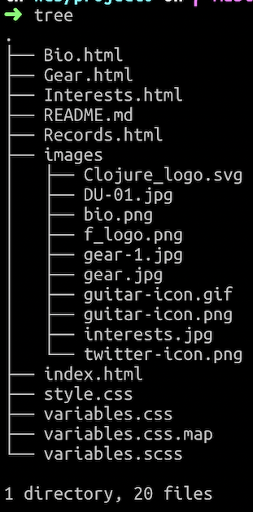

# Project 0

Web Programming with Python and JavaScript

This is a website about me, my interests and some stuff related to music and a rock band where I sing and play guitars.

It has 4 html pages and 2 stylesheet files.

"style.css" uses:

1. At least 5 different css properties;
2. At least five different types of CSS selectors;
3. Includes one mobile-responsive @media query

<variables.css>

